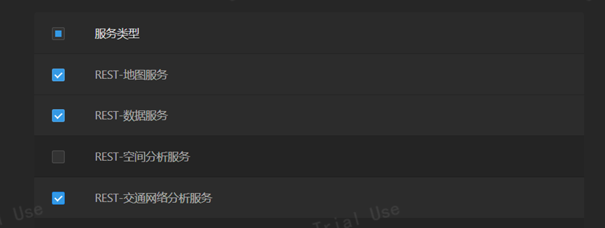
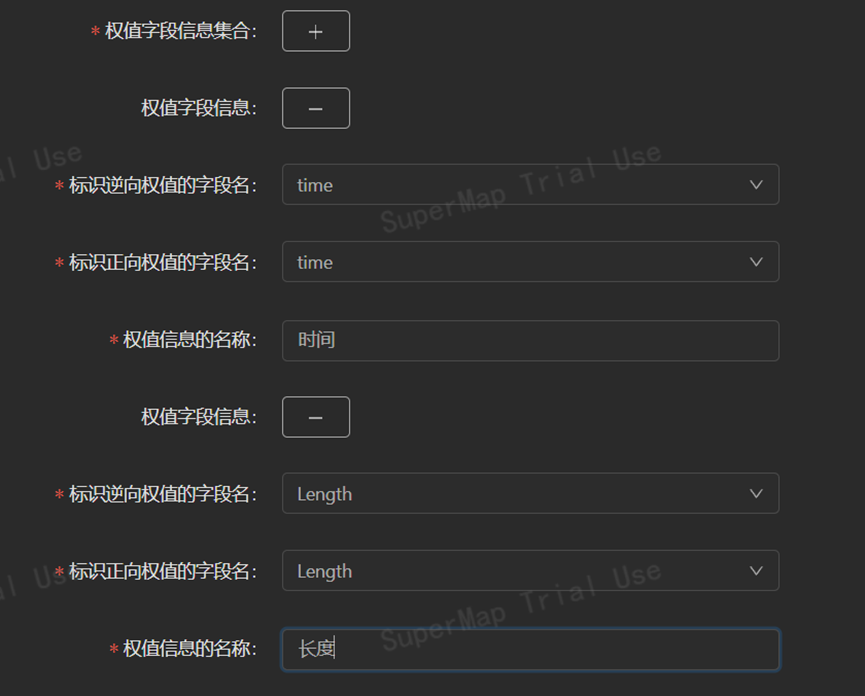

## 1 系统环境准备

#### 1.1 前端环境准备

- node.js 环境
- npm 包管理器
  _ps:本组本地测试所用版本为 node 版本 18.12.1；npm 版本为 8.19.2。_

#### 1.2 后端环境准备

- java8——jdk1.8
- maven 环境配置
- 本组 java 后端开发采用 Idea 集成开发环境
  _ps: 本组测试所用为 java version “1.8.0_333”；由于系统数据库放在云端 mysql 存储，所以不需要 mysql 数据库环境准备。如果需要本地数据库环境准备。请在 navicat 软件中运行 supermap2023.sql。并修改 application.properties 配置为自己本地的 mysql 配置。_

#### 1.3 SuperMap iServer 服务发布准备

需要在 SuperMap iServer 中发布《成果数据》文件夹里面的地图服务、数据服务、交通网络分析服务。其中交通网络分析服务权重字段选择 Length 和 time。别名分别为长度和时间。如下图 1 和图 2。


<center><font size=2>图 1 SuperMap Iserver 发布服务类型</font></center>



<center><font size=2>图 2 SuperMap Iserver 交通网络分析服务权重选择</font></center>

_ps:本组本地测试所用 SuperMap iServer 版本为 supermap-iserver-11.0.1-windows-x64_

## 2 系统部署

本次系统部署介绍为本地部署。

#### 2.1 前端部分

对《系统源程序》里面的【前端源代码】部分。使用 vsCode 或者 cmd 打开前端源码文件夹，在终端中先运行：
`npm install`
再运行：
`npm run serve`
启动前端，生成访问链接。或者在后端服务启动后，直接点击 build 好的文件夹里面 index.html 也行。
_ps:提交前端源代码已经包含打包好的文件夹 build 文件夹。_

#### 2.2 后端部分

对《系统源程序》里面的【后端源代码】部分。使用 Idea 打开源码文件夹后，运行启动类启动后端程序。或者在有 jdk8 的环境下运行【后端源代码】文件夹里面的 target 打包好的 jar 包，在 cmd 环境下运行：
`java -jar tourgis-0.0.1-SNAPSHOT.jar > log.txt 2>&1 &`
_ps:后端启动后占用端口号为 8088 端口_

#### 2.3 SuperMap iServer 服务部分

请确保系统环境准备中 1.3 节 SuperMap iServer 服务已经发布。然后可以在浏览器中访问前端在启动成功后生成的 url 链接进行项目访问。

    项目部署有问题可以联系黄鹏飞：17208260346
    另外项目已经部署到远程云服务器：http://sicnu3s.club:8090/SiChuanTour
    由于SuperMap iServer在远程服务器启动后会莫名奇妙的占用内存。所以不能保证网站一直能访问。一般2个小时后iserver会自动关闭服务。然后又要手动启动。

```

```
